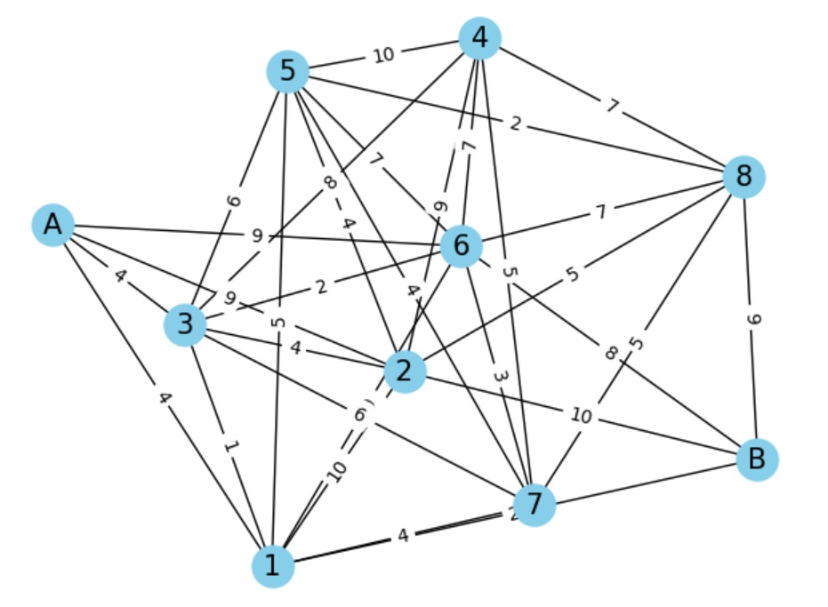
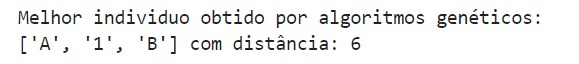

# Algoritmo Genético para o Caminho Mais Curto
Uso
O script principal para executar o algoritmo genético é `2_TrabalhoF.ipynb` com o auxílio de `functions.py`.

### Configuração
```python
start_vertex = 'A'
end_vertex = 'B'
NUM_VERTICES = 10  # Número de vértices desejado
TAMANHO_DA_POPULACAO = 10 
TAMANHO_TORNEIO = 3
NUM_GERACOES = 10
CHANCE_CRUZAMENTO = 0.5
CHANCE_MUTACAO = 0.2
```

  

### Exemplo
Aqui está um exemplo de resultado que você obterá com o algoritmo.

Grafo plotado:




Resultado:



```json
{
  "population_size": 100,
  "mutation_rate": 0.01,
  "num_generations": 200,
  "crossover_method": "one-point",
  "selection_method": "tournament",
  "graph": {
    "nodes": ["A", "B", "C", "D", "E"],
    "edges": {
      "A": {"B": 1, "C": 4},
      "B": {"A": 1, "C": 2, "D": 5},
      "C": {"A": 4, "B": 2, "D": 1},
      "D": {"B": 5, "C": 1, "E": 3},
      "E": {"D": 3}
    }
  }
}
```

Observe a saída, que mostrará o caminho mais curto encontrado e sua distância.

### Contribuições
Contribuições são bem-vindas! Por favor, siga estes passos:

Fork o repositório
Crie um novo branch (git checkout -b feature-branch)
Faça commit das suas mudanças (git commit -am 'Adicionar nova feature')
Faça push para o branch (git push origin feature-branch)
Crie um novo Pull Request
## Licença
Este projeto é licenciado sob a Licença MIT. Veja o arquivo LICENSE para detalhes.

## Contato
Se você tiver alguma pergunta ou sugestão, nos contate:
- andre23035@ilum.cnpem.br
- carlos23036@ilum.cnpem.br
- sergio23040@ilum.cnpem.br

Obrigado por estudar nosso Algoritmo Genético para o Caminho Mais Curto! Happy Coding!
